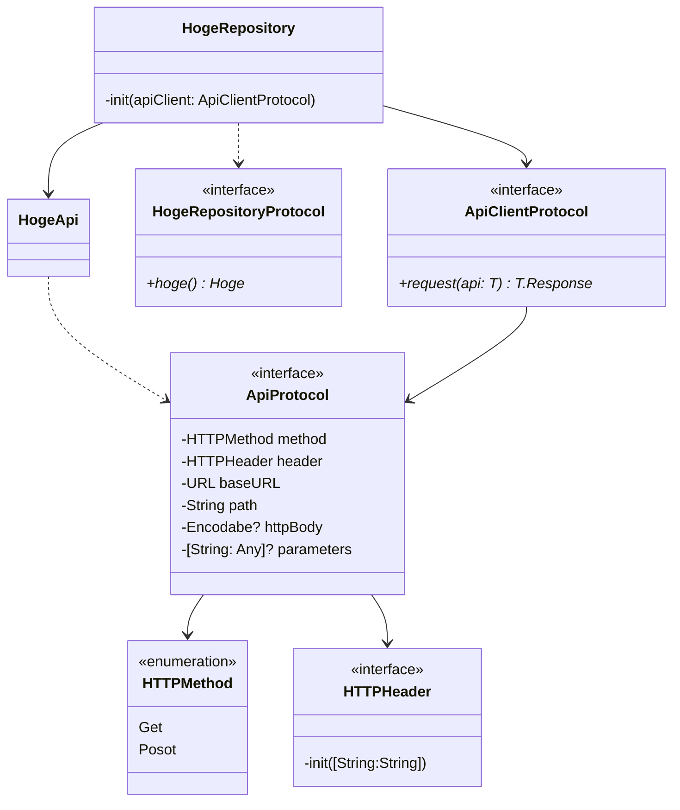

# About
- API通信の仕組みを作成
- 外部モジュールとしてAPI関連の処理をまとめる
- Swift Concurrencyによる非同期処理の実現
- ※下の図ではなくコードを見て全体を理解すること
# クラス図

```mermaid
classDiagram
class HogeApi { }
class HogeRepositoryProtocol {
    <<interface>>
    +hoge()* Hoge
}
class HogeRepository {
    -init(apiClient: ApiClientProtocol) 
}
class ApiClientProtocol {
    <<interface>>
    +request<T: RequestProtocol>(api: T)* T.Response
}
class ApiProtocol {
    <<interface>> 
    -HTTPMethod method
	-HTTPHeader header
    -URL baseURL
    -String path
	-Encodabe? httpBody 
    -[String: Any]? parameters
}
class HTTPMethod {
    <<enumeration>>
    Get
    Posot
}
class HTTPHeader {
	<<interface>>
	-init([String:String])
}
HogeApi ..> ApiProtocol
HogeRepository ..> HogeRepositoryProtocol
HogeRepository --> HogeApi
HogeRepository --> ApiClientProtocol
ApiClientProtocol --> ApiProtocol
ApiProtocol --> HTTPMethod
ApiProtocol --> HTTPHeader
```
